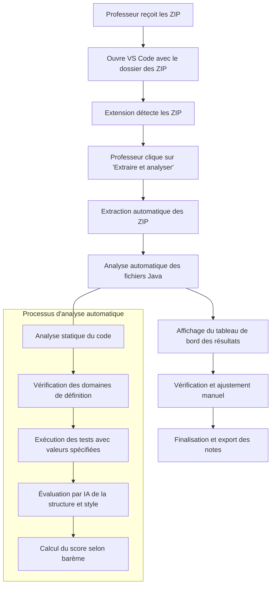

# Automatisation de la correction avec une extension VS Code

Pour automatiser la correction de cet exercice pour 50 étudiants, une extension VS Code intégrant l'IA pourrait être très efficace. Voici comment je concevrais cette solution :

## Conception de l'extension de correction automatique

### 1. Architecture principale
- Extension VS Code qui analyse le code Java soumis
- Intégration avec un système de notation basé sur le barème établi
- Interface pour visualiser les résultats et éventuellement ajuster manuellement la notation

### 2. Fonctionnalités d'analyse automatique

**Analyse statique du code :**
- Vérification de la syntaxe et structure du code Java
- Détection des méthodes principales et des structures conditionnelles
- Analyse des vérifications de domaines de définition pour chaque expression
- Examen du nommage des variables et de l'indentation

**Analyse dynamique par tests unitaires :**
- Exécution automatique du code avec les valeurs de test (-1, 0, 2, 3, 8)
- Capture des sorties pour chaque valeur
- Comparaison avec les résultats attendus

### 3. Intégration de l'IA

**Pour l'analyse du code :**
- Utilisation de l'IA pour évaluer la qualité de la structure du code
- Analyse de la lisibilité et des bonnes pratiques
- Suggestion d'améliorations possibles

**Pour l'évaluation :**
- Attribution automatique des points selon les critères définis
- Identification des erreurs récurrentes parmi les étudiants
- Génération automatique de feedback personnalisé

## Implémentation technique

```typescript
// Structure principale de l'extension

import * as vscode from 'vscode';
import * as fs from 'fs';
import * as path from 'path';
import { runJavaTests } from './testRunner';
import { codeAnalyzer } from './codeAnalyzer';
import { aiEvaluator } from './aiEvaluator';
import { createReport } from './reportGenerator';

// Activation de l'extension
export function activate(context: vscode.ExtensionContext) {
    
    const disposable = vscode.commands.registerCommand('javaCorrector.evaluateSubmission', async () => {
        const workspaceFolders = vscode.workspace.workspaceFolders;
        if (!workspaceFolders) {
            vscode.window.showErrorMessage("Aucun dossier de travail ouvert");
            return;
        }
        
        // Sélectionner le dossier contenant les soumissions
        const submissionsFolder = await vscode.window.showOpenDialog({
            canSelectFiles: false,
            canSelectFolders: true,
            canSelectMany: false,
            openLabel: 'Sélectionner le dossier des soumissions'
        });
        
        if (!submissionsFolder || submissionsFolder.length === 0) {
            return;
        }
        
        const folderPath = submissionsFolder[0].fsPath;
        const submissions = getStudentSubmissions(folderPath);
        
        // Lancer l'évaluation pour chaque soumission
        const results = [];
        for (const submission of submissions) {
            vscode.window.showInformationMessage(`Évaluation de: ${submission.studentId}`);
            
            // Analyser le code source
            const codeAnalysis = await codeAnalyzer.analyze(submission.filePath);
            
            // Exécuter les tests
            const testResults = await runJavaTests(submission.filePath, [
                { input: "-1", expectedOutputs: ["Expression 1 : indéfinie", "Expression 2 : indéfinie", "Expression 3 : -0.6666666666666666"] },
                { input: "0", expectedOutputs: ["Expression 1 : indéfinie", "Expression 2 : 0.0", "Expression 3 : indéfinie"] },
                { input: "2", expectedOutputs: null }, // Calcul attendu sans valeurs fixes
                { input: "3", expectedOutputs: null },
                { input: "8", expectedOutputs: null }
            ]);
            
            // Utiliser l'IA pour évaluer la qualité du code
            const aiEvaluation = await aiEvaluator.evaluate(submission.filePath, codeAnalysis, testResults);
            
            // Calculer les points selon le barème
            const score = calculateScore(codeAnalysis, testResults, aiEvaluation);
            
            results.push({
                studentId: submission.studentId,
                score: score,
                analysis: codeAnalysis,
                testResults: testResults,
                aiEvaluation: aiEvaluation,
                feedback: generateFeedback(codeAnalysis, testResults, aiEvaluation)
            });
        }
        
        // Générer un rapport global et individuel
        await createReport(results, path.join(folderPath, 'evaluation_results'));
        
        vscode.window.showInformationMessage(`Évaluation terminée pour ${results.length} soumission(s)`);
    });
    
    context.subscriptions.push(disposable);
}

// Récupérer la liste des soumissions
function getStudentSubmissions(folderPath: string): Array<{studentId: string, filePath: string}> {
    const submissions = [];
    const files = fs.readdirSync(folderPath);
    
    for (const file of files) {
        if (file.endsWith('.java')) {
            const studentId = file.split('_')[0]; // Supposant un format "studentId_Formules.java"
            submissions.push({
                studentId: studentId,
                filePath: path.join(folderPath, file)
            });
        }
    }
    
    return submissions;
}

// Calculer le score selon le barème
function calculateScore(codeAnalysis: any, testResults: any, aiEvaluation: any): number {
    let score = 0;
    
    // Fonctionnalités essentielles (10 points)
    score += codeAnalysis.hasValidInput ? 2 : 0;
    score += codeAnalysis.domainChecks.score; // 0-4 points
    score += testResults.functionalityScore; // 0-4 points
    
    // Structure et style (6 points)
    score += aiEvaluation.structureScore; // 0-2 points
    score += aiEvaluation.readabilityScore; // 0-2 points
    score += codeAnalysis.exceptionHandling ? 2 : 0;
    
    // Tests (4 points)
    score += testResults.testCasesScore; // 0-4 points
    
    return Math.min(20, Math.max(0, score)); // Score entre 0 et 20
}

// Générer un feedback personnalisé
function generateFeedback(codeAnalysis: any, testResults: any, aiEvaluation: any): string {
    let feedback = "";
    
    // Ajout des commentaires sur les points forts
    feedback += "Points forts:\n";
    feedback += aiEvaluation.strengths.join('\n');
    
    // Ajout des commentaires sur les points à améliorer
    feedback += "\n\nPoints à améliorer:\n";
    feedback += aiEvaluation.weaknesses.join('\n');
    
    // Ajout des suggestions spécifiques
    feedback += "\n\nSuggestions d'amélioration:\n";
    feedback += aiEvaluation.suggestions.join('\n');
    
    return feedback;
}

export function deactivate() {}

```

```typescript
// codeAnalyzer.ts - Module d'analyse statique du code

import * as fs from 'fs';
import * as parser from 'java-parser';

export const codeAnalyzer = {
    analyze: async (filePath: string) => {
        const sourceCode = fs.readFileSync(filePath, 'utf8');
        
        try {
            // Parser le code Java
            const ast = parser.parse(sourceCode);
            
            // Initialiser les résultats d'analyse
            const result = {
                hasValidInput: false,
                hasMainMethod: false,
                domainChecks: {
                    expr1: false, // Vérifie si x > 0 pour log(x)
                    expr2: false, // Vérifie si x >= 0 pour sqrt(x)
                    expr3: false, // Vérifie si x != 0 pour 1/x
                    score: 0      // Score sur 4 points
                },
                correctExpressions: {
                    expr1: false,
                    expr2: false,
                    expr3: false
                },
                exceptionHandling: false,
                indentation: 0,    // Score sur 1
                variableNaming: 0, // Score sur 1
                comments: 0        // Score sur 1
            };
            
            // Vérifier la présence d'une méthode main
            result.hasMainMethod = checkForMainMethod(ast);
            
            // Vérifier la présence de la saisie utilisateur
            result.hasValidInput = checkForUserInput(ast, sourceCode);
            
            // Analyser les vérifications de domaine
            analyzeDomainChecks(ast, sourceCode, result);
            
            // Vérifier la présence des expressions correctes
            checkExpressions(sourceCode, result);
            
            // Vérifier la gestion des exceptions
            result.exceptionHandling = checkExceptionHandling(ast, sourceCode);
            
            // Évaluer l'indentation et le style
            result.indentation = evaluateIndentation(sourceCode);
            result.variableNaming = evaluateVariableNaming(ast);
            result.comments = evaluateComments(sourceCode);
            
            // Calculer le score total pour les vérifications de domaine
            calculateDomainCheckScore(result);
            
            return result;
            
        } catch (error) {
            console.error('Erreur lors de l\'analyse du code:', error);
            return {
                error: 'Erreur de parsing: le code ne compile probablement pas',
                hasValidInput: false,
                hasMainMethod: false,
                domainChecks: { expr1: false, expr2: false, expr3: false, score: 0 },
                correctExpressions: { expr1: false, expr2: false, expr3: false },
                exceptionHandling: false,
                indentation: 0,
                variableNaming: 0,
                comments: 0
            };
        }
    }
};

// Fonctions d'analyse détaillées
function checkForMainMethod(ast: any): boolean {
    // Logique pour vérifier la présence d'une méthode main
    // ...
    return true; // Placeholder
}

function checkForUserInput(ast: any, sourceCode: string): boolean {
    // Vérifier l'utilisation de Scanner ou autre
    const hasScanner = sourceCode.includes('Scanner') || sourceCode.includes('nextDouble') || sourceCode.includes('nextFloat');
    return hasScanner;
}

function analyzeDomainChecks(ast: any, sourceCode: string, result: any): void {
    // Vérifier la présence des conditions de domaine de définition
    
    // Expression 1: x > 0 pour log(x)
    result.domainChecks.expr1 = sourceCode.includes('x > 0') && 
                                (sourceCode.indexOf('Math.log') > sourceCode.indexOf('x > 0'));
    
    // Expression 2: x >= 0 pour sqrt(x)
    result.domainChecks.expr2 = sourceCode.includes('x >= 0') && 
                                (sourceCode.indexOf('Math.sqrt(x)') > sourceCode.indexOf('x >= 0'));
    
    // Expression 3: x != 0 pour 1/x
    result.domainChecks.expr3 = sourceCode.includes('x != 0') && 
                                (sourceCode.indexOf('1 / x') > sourceCode.indexOf('x != 0'));
}

function checkExpressions(sourceCode: string, result: any): void {
    // Vérifier la présence des expressions correctes
    result.correctExpressions.expr1 = sourceCode.includes('Math.log(x) - Math.sqrt(Math.abs(x))');
    result.correctExpressions.expr2 = sourceCode.includes('Math.sqrt(x)');
    result.correctExpressions.expr3 = sourceCode.includes('1 / x - Math.sin(x)');
}

function checkExceptionHandling(ast: any, sourceCode: string): boolean {
    // Vérifier la présence de try-catch ou autre gestion d'erreurs
    const hasTryCatch = sourceCode.includes('try') && sourceCode.includes('catch');
    
    // Vérifier si Scanner est fermé
    const scannerClosed = sourceCode.includes('scanner.close()');
    
    return hasTryCatch || scannerClosed;
}

function evaluateIndentation(sourceCode: string): number {
    // Algorithme simple pour évaluer la qualité de l'indentation
    const lines = sourceCode.split('\n');
    let correctlyIndented = 0;
    
    // Logique d'analyse d'indentation
    // ...
    
    return correctlyIndented > lines.length * 0.8 ? 1 : 0.5;
}

function evaluateVariableNaming(ast: any): number {
    // Évaluer la qualité du nommage des variables
    // ...
    return 0.5; // Placeholder
}

function evaluateComments(sourceCode: string): number {
    // Évaluer la présence et la pertinence des commentaires
    const hasComments = sourceCode.includes('//') || sourceCode.includes('/*');
    return hasComments ? 0.5 : 0;
}

function calculateDomainCheckScore(result: any): void {
    // Calculer le score pour les vérifications de domaine
    let score = 0;
    if (result.domainChecks.expr1) score += 1.5;
    if (result.domainChecks.expr2) score += 1;
    if (result.domainChecks.expr3) score += 1.5;
    
    result.domainChecks.score = score;
}

```

## Workflow de correction

1. **Préparation des soumissions :**
   - Les étudiants soumettent leurs fichiers `Formules.java` via un système LMS ou GitHub
   - L'enseignant organise les fichiers dans un dossier avec une convention de nommage (ex: `étudiant_ID_Formules.java`)

2. **Processus d'évaluation automatisé :**
   - L'enseignant ouvre VS Code et active l'extension
   - L'extension analyse automatiquement chaque soumission
   - Pour chaque soumission, l'extension exécute les tests avec les valeurs demandées
   - L'IA analyse la qualité du code et attribue les points selon le barème

3. **Visualisation et ajustement :**
   - Interface de tableau de bord montrant les résultats pour tous les étudiants
   - Vue détaillée pour chaque soumission avec la répartition des points
   - Option pour l'enseignant d'ajuster manuellement les notes
   - Génération de commentaires personnalisés pour chaque étudiant

4. **Génération de rapports :**
   - Export des résultats en CSV ou PDF
   - Création de rapports individuels pour chaque étudiant
   - Statistiques globales sur les performances de la classe

## Avantages pour l'enseignant

1. **Gain de temps considérable** - correction automatisée de 50 soumissions
2. **Cohérence dans l'évaluation** - application uniforme du barème
3. **Détection des erreurs courantes** - identification des concepts mal compris par les étudiants
4. **Feedback personnalisé** - généré par l'IA pour chaque étudiant
5. **Données analytiques** - vision globale sur les forces et faiblesses de la classe

## Considérations techniques

- L'extension nécessiterait Java JDK pour compiler et exécuter les soumissions
- Utilisation d'un parser Java pour l'analyse statique du code
- Intégration d'une API d'IA comme OpenAI ou Claude pour l'analyse qualitative
- Système de gestion des résultats avec persistance locale
- Interface utilisateur claire pour visualiser et ajuster les résultats

Cette extension permettrait d'automatiser efficacement le processus de correction tout en maintenant un haut niveau de qualité d'évaluation, et en laissant à l'enseignant la possibilité d'intervenir pour les cas particuliers.


# Nouveau workflow de correction avec extraction automatique des ZIP

Vous avez tout à fait raison, l'approche avec extraction automatique des ZIP est beaucoup plus pratique pour un professeur. Voici une refonte du workflow qui intègre cette vision :

## Workflow de correction amélioré

### 1. Préparation initiale
- Le professeur reçoit les travaux des étudiants sous forme de fichiers ZIP (probablement par email ou via un système LMS)
- Le professeur crée un dossier sur son ordinateur et y place tous les fichiers ZIP

### 2. Utilisation de l'extension VS Code
- Le professeur ouvre VS Code et charge le dossier contenant les ZIP
- L'extension détecte automatiquement les fichiers ZIP et affiche le nombre de soumissions trouvées
- Une interface moderne s'affiche avec un dashboard principal

### 3. Extraction et organisation automatiques
- Un bouton "Extraire et analyser les soumissions" est mis en évidence
- En cliquant, l'extension :
  - Crée un dossier "soumissions_extraites" 
  - Extrait chaque ZIP dans un sous-dossier nommé selon l'identifiant de l'étudiant
  - Identifie le fichier Java principal à corriger dans chaque soumission
  - Organise les fichiers de manière cohérente

### 4. Analyse automatique
- L'extension lance automatiquement l'analyse de chaque fichier `Formules.java` extrait
- Une barre de progression indique l'avancement de l'analyse
- L'IA examine chaque travail selon les critères du barème

### 5. Visualisation des résultats
- Un tableau de bord affiche l'ensemble des résultats avec :
  - Liste des étudiants avec leurs notes calculées
  - Indicateurs visuels sur les points forts/faibles de chaque soumission
  - Possibilité de filtrer et trier les résultats

### 6. Vérification et ajustement
- Le professeur peut sélectionner une soumission pour voir l'évaluation détaillée
- Interface côte à côte : code de l'étudiant et analyse détaillée
- Options pour ajuster manuellement les points attribués
- Possibilité d'ajouter des commentaires personnalisés

### 7. Finalisation et export
- Bouton pour finaliser toutes les évaluations
- Génération automatique de rapports individuels
- Export des notes en CSV/Excel pour le système de gestion des notes
- Option pour archiver l'ensemble des travaux corrigés



## Conception technique de l'extension

```typescript
// extension.ts - Point d'entrée principal de l'extension

import * as vscode from 'vscode';
import * as fs from 'fs';
import * as path from 'path';
import * as AdmZip from 'adm-zip';
import { analyzeJavaSubmission } from './analyzer';
import { createWebviewPanel } from './webviewPanel';
import { exportResults } from './exporter';

// État global de l'extension
let submissionsData: SubmissionData[] = [];

interface SubmissionData {
    studentId: string;
    zipPath: string;
    extractedPath?: string;
    javaFilePath?: string;
    analysisResults?: any;
    score?: number;
    manualAdjustment?: number;
    teacherComments?: string;
}

export function activate(context: vscode.ExtensionContext) {
    
    // Commande principale pour ouvrir le tableau de bord
    const openDashboardCommand = vscode.commands.registerCommand('javaCorrector.openDashboard', () => {
        const panel = createWebviewPanel(context.extensionUri);
        
        // Détecter les fichiers ZIP dans le dossier ouvert
        const zipFiles = detectZipFiles();
        if (zipFiles.length === 0) {
            panel.webview.postMessage({ 
                command: 'noZipFound'
            });
            return;
        }
        
        // Initialiser les données des soumissions
        submissionsData = zipFiles.map(zipPath => ({
            studentId: extractStudentIdFromZipName(zipPath),
            zipPath: zipPath
        }));
        
        // Informer le webview du nombre de soumissions trouvées
        panel.webview.postMessage({ 
            command: 'submissionsFound',
            count: submissionsData.length,
            submissions: submissionsData
        });
        
        // Gérer les messages du webview
        panel.webview.onDidReceiveMessage(async message => {
            switch (message.command) {
                case 'extractAndAnalyze':
                    await extractAndAnalyzeSubmissions(panel);
                    break;
                case 'viewSubmissionDetails':
                    showSubmissionDetails(message.studentId);
                    break;
                case 'updateScore':
                    updateSubmissionScore(message.studentId, message.newScore, message.comments);
                    panel.webview.postMessage({ 
                        command: 'scoreUpdated',
                        studentId: message.studentId
                    });
                    break;
                case 'exportResults':
                    const exportPath = await exportResults(submissionsData);
                    panel.webview.postMessage({ 
                        command: 'exportCompleted',
                        path: exportPath
                    });
                    break;
            }
        });
    });
    
    context.subscriptions.push(openDashboardCommand);
}

// Détecter tous les fichiers ZIP dans le workspace actuel
function detectZipFiles(): string[] {
    const workspaceFolders = vscode.workspace.workspaceFolders;
    if (!workspaceFolders) {
        return [];
    }
    
    const rootPath = workspaceFolders[0].uri.fsPath;
    const zipFiles: string[] = [];
    
    const files = fs.readdirSync(rootPath);
    files.forEach(file => {
        if (file.endsWith('.zip')) {
            zipFiles.push(path.join(rootPath, file));
        }
    });
    
    return zipFiles;
}

// Extraire l'ID de l'étudiant à partir du nom du fichier ZIP
function extractStudentIdFromZipName(zipPath: string): string {
    const filename = path.basename(zipPath, '.zip');
    // Supposons que le format est "NOM_Prénom_ID" ou similaire
    const parts = filename.split('_');
    if (parts.length >= 2) {
        return `${parts[0]}_${parts[1]}`;
    }
    return filename; // Fallback si format non standard
}

// Extraire et analyser toutes les soumissions
async function extractAndAnalyzeSubmissions(panel: vscode.WebviewPanel): Promise<void> {
    const workspaceFolders = vscode.workspace.workspaceFolders;
    if (!workspaceFolders) {
        return;
    }
    
    const rootPath = workspaceFolders[0].uri.fsPath;
    const extractionFolder = path.join(rootPath, 'soumissions_extraites');
    
    // Créer le dossier d'extraction s'il n'existe pas
    if (!fs.existsSync(extractionFolder)) {
        fs.mkdirSync(extractionFolder);
    }
    
    // Informer le webview que l'extraction commence
    panel.webview.postMessage({ command: 'extractionStarted' });
    
    // Traiter chaque soumission
    for (let i = 0; i < submissionsData.length; i++) {
        const submission = submissionsData[i];
        
        // Mettre à jour la progression
        panel.webview.postMessage({ 
            command: 'progressUpdate',
            current: i + 1,
            total: submissionsData.length,
            studentId: submission.studentId
        });
        
        try {
            // Extraire le ZIP
            const studentFolder = path.join(extractionFolder, submission.studentId);
            if (!fs.existsSync(studentFolder)) {
                fs.mkdirSync(studentFolder);
            }
            
            const zip = new AdmZip(submission.zipPath);
            zip.extractAllTo(studentFolder, true);
            submission.extractedPath = studentFolder;
            
            // Rechercher le fichier Java à analyser
            submission.javaFilePath = findJavaFile(studentFolder, 'Formules.java');
            
            if (submission.javaFilePath) {
                // Analyser le fichier Java
                submission.analysisResults = await analyzeJavaSubmission(submission.javaFilePath);
                submission.score = calculateScore(submission.analysisResults);
                
                // Informer le webview de l'analyse terminée pour cet étudiant
                panel.webview.postMessage({ 
                    command: 'submissionAnalyzed',
                    studentId: submission.studentId,
                    score: submission.score,
                    results: submission.analysisResults
                });
            } else {
                // Fichier Java non trouvé
                panel.webview.postMessage({ 
                    command: 'submissionError',
                    studentId: submission.studentId,
                    error: 'Fichier Formules.java non trouvé'
                });
            }
        } catch (error) {
            // Erreur lors de l'extraction ou de l'analyse
            panel.webview.postMessage({ 
                command: 'submissionError',
                studentId: submission.studentId,
                error: `Erreur: ${error}`
            });
        }
    }
    
    // Informer le webview que l'analyse est terminée
    panel.webview.postMessage({ 
        command: 'analysisCompleted',
        submissions: submissionsData
    });
}

// Rechercher un fichier Java spécifique dans un dossier (récursivement)
function findJavaFile(folderPath: string, targetFilename: string): string | undefined {
    const files = fs.readdirSync(folderPath);
    
    for (const file of files) {
        const filePath = path.join(folderPath, file);
        const stat = fs.statSync(filePath);
        
        if (stat.isDirectory()) {
            // Rechercher récursivement dans les sous-dossiers
            const result = findJavaFile(filePath, targetFilename);
            if (result) {
                return result;
            }
        } else if (file.toLowerCase() === targetFilename.toLowerCase()) {
            return filePath;
        }
    }
    
    return undefined;
}

// Calculer le score total selon le barème
function calculateScore(analysisResults: any): number {
    let score = 0;
    
    // Fonctionnalités essentielles (10 points)
    score += analysisResults.inputHandling ? 2 : 0; // Saisie utilisateur
    score += analysisResults.domainChecks.score; // Vérifications des domaines (4 points)
    score += analysisResults.expressionsImplementation; // Implémentation des expressions (4 points)
    
    // Structure et style de code (6 points)
    score += analysisResults.codeStructure; // Organisation du code (2 points)
    score += analysisResults.codeReadability; // Lisibilité et conventions (2 points)
    score += analysisResults.exceptionHandling ? 2 : 0; // Gestion des exceptions (2 points)
    
    // Tests (4 points)
    score += analysisResults.testResults.score; // Résultats des tests (4 points)
    
    return Math.min(20, Math.max(0, score)); // Limiter entre 0 et 20
}

// Afficher les détails d'une soumission
function showSubmissionDetails(studentId: string): void {
    const submission = submissionsData.find(s => s.studentId === studentId);
    if (!submission || !submission.javaFilePath) {
        return;
    }
    
    // Ouvrir le fichier dans l'éditeur
    vscode.workspace.openTextDocument(submission.javaFilePath).then(doc => {
        vscode.window.showTextDocument(doc, vscode.ViewColumn.One);
        
        // Afficher les détails d'analyse dans un panneau à côté
        const panel = vscode.window.createWebviewPanel(
            'submissionDetails',
            `Analyse - ${studentId}`,
            vscode.ViewColumn.Two,
            { enableScripts: true }
        );
        
        panel.webview.html = generateDetailViewHtml(submission);
    });
}

// Mettre à jour le score et les commentaires d'une soumission
function updateSubmissionScore(studentId: string, newScore: number, comments: string): void {
    const submission = submissionsData.find(s => s.studentId === studentId);
    if (submission) {
        submission.manualAdjustment = newScore - (submission.score || 0);
        submission.score = newScore;
        submission.teacherComments = comments;
    }
}

// Générer le HTML pour la vue détaillée
function generateDetailViewHtml(submission: SubmissionData): string {
    // Code pour générer le HTML du panneau de détails
    // ...
    return `<!DOCTYPE html>
    <html>
    <head>
        <meta charset="UTF-8">
        <title>Détails d'analyse</title>
        <style>
            /* Styles CSS pour l'interface */
        </style>
    </head>
    <body>
        <h1>Analyse détaillée - ${submission.studentId}</h1>
        <!-- Affichage des détails d'analyse -->
    </body>
    </html>`;
}

export function deactivate() {}

```

## Interface utilisateur moderne

```html
<!DOCTYPE html>
<html lang="fr">
<head>
    <meta charset="UTF-8">
    <meta name="viewport" content="width=device-width, initial-scale=1.0">
    <title>Correcteur Java - Dashboard</title>
    <style>
        :root {
            --primary-color: #2c3e50;
            --secondary-color: #3498db;
            --success-color: #2ecc71;
            --warning-color: #f39c12;
            --danger-color: #e74c3c;
            --light-color: #ecf0f1;
            --dark-color: #34495e;
            --shadow: 0 4px 6px rgba(0, 0, 0, 0.1);
        }
        
        body {
            font-family: 'Segoe UI', Tahoma, Geneva, Verdana, sans-serif;
            margin: 0;
            padding: 0;
            background-color: #f5f7fa;
            color: #333;
        }
        
        .container {
            max-width: 1200px;
            margin: 0 auto;
            padding: 20px;
        }
        
        header {
            display: flex;
            justify-content: space-between;
            align-items: center;
            margin-bottom: 30px;
            padding-bottom: 15px;
            border-bottom: 1px solid #ddd;
        }
        
        header h1 {
            margin: 0;
            color: var(--primary-color);
            font-size: 24px;
        }
        
        .btn {
            padding: 10px 20px;
            border: none;
            border-radius: 4px;
            cursor: pointer;
            font-weight: 600;
            transition: all 0.3s ease;
        }
        
        .btn-primary {
            background-color: var(--secondary-color);
            color: white;
        }
        
        .btn-primary:hover {
            background-color: #2980b9;
        }
        
        .btn-success {
            background-color: var(--success-color);
            color: white;
        }
        
        .btn-success:hover {
            background-color: #27ae60;
        }
        
        .status-box {
            background-color: white;
            border-radius: 8px;
            padding: 20px;
            box-shadow: var(--shadow);
            margin-bottom: 30px;
            text-align: center;
        }
        
        .status-box h2 {
            margin-top: 0;
            color: var(--primary-color);
        }
        
        .status-box.initial {
            background-color: var(--light-color);
        }
        
        .status-box.success {
            background-color: #e8f8f5;
        }
        
        .progress-container {
            background-color: #ddd;
            border-radius: 20px;
            margin: 15px 0;
            height: 20px;
            width: 100%;
        }
        
        .progress-bar {
            height: 100%;
            border-radius: 20px;
            background-color: var(--secondary-color);
            width: 0%;
            transition: width 0.3s ease;
        }
        
        .submissions-table {
            width: 100%;
            border-collapse: collapse;
            margin-top: 20px;
            background-color: white;
            box-shadow: var(--shadow);
            border-radius: 8px;
            overflow: hidden;
        }
        
        .submissions-table th, .submissions-table td {
            padding: 12px 15px;
            text-align: left;
            border-bottom: 1px solid #ddd;
        }
        
        .submissions-table th {
            background-color: var(--primary-color);
            color: white;
            font-weight: 600;
        }
        
        .submissions-table tr:hover {
            background-color: #f1f8ff;
        }
        
        .submissions-table tr:last-child td {
            border-bottom: none;
        }
        
        .status-icon {
            display: inline-block;
            width: 12px;
            height: 12px;
            border-radius: 50%;
            margin-right: 5px;
        }
        
        .status-pending {
            background-color: #bdc3c7;
        }
        
        .status-processing {
            background-color: var(--warning-color);
        }
        
        .status-complete {
            background-color: var(--success-color);
        }
        
        .status-error {
            background-color: var(--danger-color);
        }
        
        .footer {
            display: flex;
            justify-content: space-between;
            margin-top: 30px;
            padding-top: 15px;
            border-top: 1px solid #ddd;
        }
        
        .detail-view {
            display: none;
            margin-top: 20px;
            background-color: white;
            border-radius: 8px;
            padding: 20px;
            box-shadow: var(--shadow);
        }
        
        .detail-view h3 {
            margin-top: 0;
            color: var(--primary-color);
        }
        
        .criteria-section {
            margin-bottom: 20px;
        }
        
        .criteria-item {
            display: flex;
            justify-content: space-between;
            padding: 8px 0;
            border-bottom: 1px solid #eee;
        }
        
        .criteria-item:last-child {
            border-bottom: none;
        }
        
        .score-input {
            width: 60px;
            padding: 5px;
            border: 1px solid #ddd;
            border-radius: 4px;
        }
        
        .comments-area {
            width: 100%;
            min-height: 100px;
            padding: 10px;
            border: 1px solid #ddd;
            border-radius: 4px;
            resize: vertical;
            margin-top: 10px;
        }
    </style>
</head>
<body>
    <div class="container">
        <header>
            <h1>Correcteur Java - Formules.java</h1>
            <div>
                <button id="btn-export" class="btn btn-success" disabled>Exporter les résultats</button>
            </div>
        </header>
        
        <div id="initial-status" class="status-box initial">
            <h2>Détection des soumissions</h2>
            <p id="submissions-count">12 fichiers ZIP détectés dans le dossier actuel</p>
            <button id="btn-start" class="btn btn-primary">Extraire et analyser les soumissions</button>
        </div>
        
        <div id="progress-status" class="status-box" style="display: none;">
            <h2>Analyse en cours</h2>
            <div class="progress-container">
                <div id="progress-bar" class="progress-bar" style="width: 25%;"></div>
            </div>
            <p id="progress-text">Analyse de 3/12 soumissions</p>
            <p id="current-student">Traitement en cours : DUPONT_Jean</p>
        </div>
        
        <div id="results-container" style="display: none;">
            <div class="filter-bar">
                <input type="text" id="search-input" placeholder="Rechercher un étudiant..." />
                <select id="sort-select">
                    <option value="name">Trier par nom</option>
                    <option value="score-desc">Note (décroissant)</option>
                    <option value="score-asc">Note (croissant)</option>
                </select>
            </div>
            
            <table class="submissions-table">
                <thead>
                    <tr>
                        <th>Étudiant</th>
                        <th>Statut</th>
                        <th>Note /20</th>
                        <th>Fonctionnalités /10</th>
                        <th>Structure /6</th>
                        <th>Tests /4</th>
                        <th>Actions</th>
                    </tr>
                </thead>
                <tbody id="submissions-list">
                    <tr>
                        <td>DUPONT_Jean</td>
                        <td><span class="status-icon status-complete"></span> Complété</td>
                        <td>17.5</td>
                        <td>9</td>
                        <td>5</td>
                        <td>3.5</td>
                        <td><button class="btn btn-primary btn-small">Détails</button></td>
                    </tr>
                    <tr>
                        <td>MARTIN_Sophie</td>
                        <td><span class="status-icon status-complete"></span> Complété</td>
                        <td>15</td>
                        <td>8</td>
                        <td>4</td>
                        <td>3</td>
                        <td><button class="btn btn-primary btn-small">Détails</button></td>
                    </tr>
                    <tr>
                        <td>DUBOIS_Pierre</td>
                        <td><span class="status-icon status-error"></span> Erreur</td>
                        <td>--</td>
                        <td>--</td>
                        <td>--</td>
                        <td>--</td>
                        <td><button class="btn btn-primary btn-small">Détails</button></td>
                    </tr>
                </tbody>
            </table>
        </div>
        
        <div id="detail-view" class="detail-view">
            <h3>Détails de l'évaluation - <span id="detail-student-name">DUPONT_Jean</span></h3>
            
            <div class="criteria-section">
                <h4>Fonctionnalités essentielles (10 points)</h4>
                <div class="criteria-item">
                    <span>Saisie utilisateur correcte (2 points)</span>
                    <input type="number" class="score-input" value="2" min="0" max="2" step="0.5" />
                </div>
                <div class="criteria-item">
                    <span>Vérification des domaines de définition (4 points)</span>
                    <input type="number" class="score-input" value="3.5" min="0" max="4" step="0.5" />
                </div>
                <div class="criteria-item">
                    <span>Calcul et affichage des résultats (4 points)</span>
                    <input type="number" class="score-input" value="3.5" min="0" max="4" step="0.5" />
                </div>
            </div>
            
            <div class="criteria-section">
                <h4>Structure et style de code (6 points)</h4>
                <div class="criteria-item">
                    <span>Organisation du code (2 points)</span>
                    <input type="number" class="score-input" value="2" min="0" max="2" step="0.5" />
                </div>
                <div class="criteria-item">
                    <span>Lisibilité et conventions (2 points)</span>
                    <input type="number" class="score-input" value="1.5" min="0" max="2" step="0.5" />
                </div>
                <div class="criteria-item">
                    <span>Gestion des exceptions (2 points)</span>
                    <input type="number" class="score-input" value="1.5" min="0" max="2" step="0.5" />
                </div>
            </div>
            
            <div class="criteria-section">
                <h4>Tests (4 points)</h4>
                <div class="criteria-item">
                    <span>Résultats corrects pour les valeurs de test</span>
                    <input type="number" class="score-input" value="3.5" min="0" max="4" step="0.5" />
                </div>
            </div>
            
            <div class="criteria-section">
                <h4>Note totale</h4>
                <div class="criteria-item">
                    <span><strong>Total</strong></span>
                    <span><strong>17.5</strong> / 20</span>
                </div>
            </div>
            
            <div class="criteria-section">
                <h4>Commentaires du professeur</h4>
                <textarea class="comments-area" placeholder="Ajouter vos commentaires ici...">Travail bien structuré. Les vérifications des domaines de définition sont correctes mais manquent de clarté pour l'expression 3. Bonne gestion des tests avec valeurs négatives.</textarea>
            </div>
            
            <div class="footer">
                <button class="btn btn-primary" id="btn-save-details">Enregistrer les modifications</button>
                <button class="btn" id="btn-close-details">Fermer</button>
            </div>
        </div>
        
        <div class="footer">
            <p>Total: <span id="total-submissions">12</span> soumissions | Complétées: <span id="completed-submissions">2</span> | Note moyenne: <span id="average-score">16.25</span>/20</p>
        </div>
    </div>
    
    <script>
        // JavaScript pour la gestion interactive de l'interface
        document.getElementById('btn-start').addEventListener('click', function() {
            document.getElementById('initial-status').style.display = 'none';
            document.getElementById('progress-status').style.display = 'block';
            // Simuler le démarrage de l'analyse
        });
        
        // Autres fonctions JavaScript pour la gestion des événements et de l'interface
    </script>
</body>
</html>

```

## Avantages de cette approche

1. **Expérience utilisateur simplifiée**
   - Interface unifiée pour tout le processus de correction
   - Visualisation claire des résultats et de la progression
   - Réduction des étapes manuelles pour le professeur

2. **Gain de temps considérable**
   - Automatisation de l'extraction des ZIP
   - Détection intelligente des fichiers Java à analyser
   - Traitement par lots de toutes les soumissions

3. **Analyse approfondie**
   - Vérification technique du code conforme au barème
   - Utilisation de l'IA pour évaluer la qualité et la structure
   - Tests automatiques avec les valeurs spécifiées

4. **Flexibilité pour le professeur**
   - Possibilité d'ajuster les notes automatiques
   - Ajout de commentaires personnalisés
   - Visualisation du code source pendant l'évaluation

5. **Traçabilité et archivage**
   - Conservation des soumissions originales et extraites
   - Historique des évaluations
   - Export des résultats pour intégration aux systèmes de notes

Cette approche offre un équilibre parfait entre automatisation et contrôle, permettant au professeur de se concentrer sur l'évaluation qualitative tout en bénéficiant d'une analyse technique rigoureuse et automatisée.